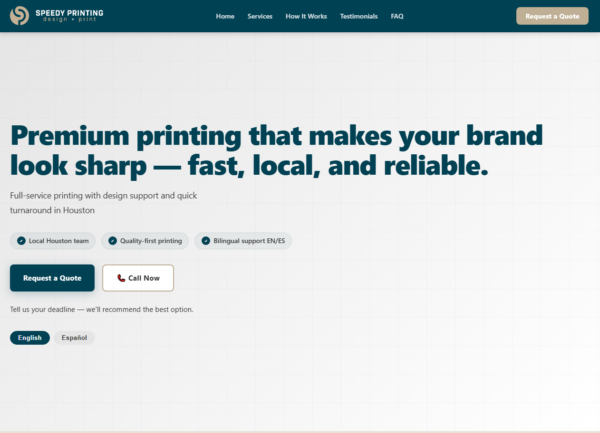
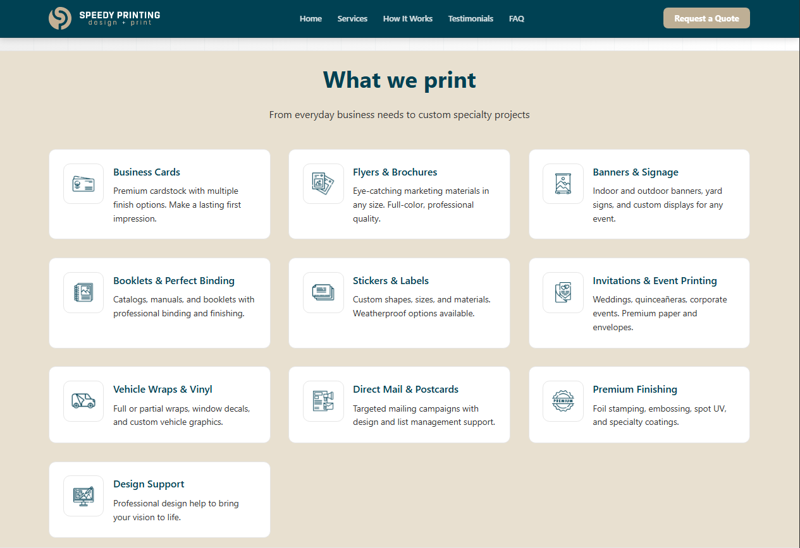
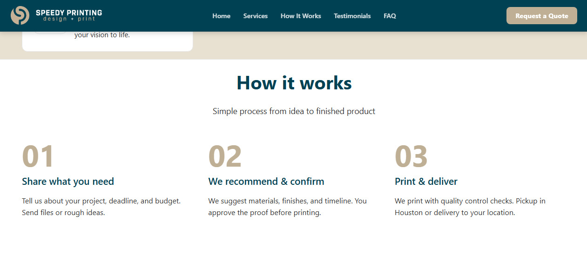
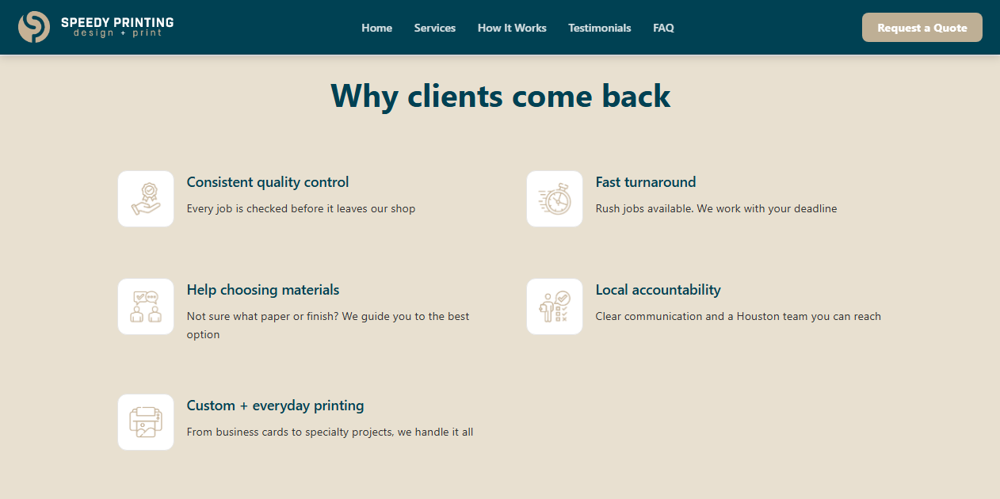
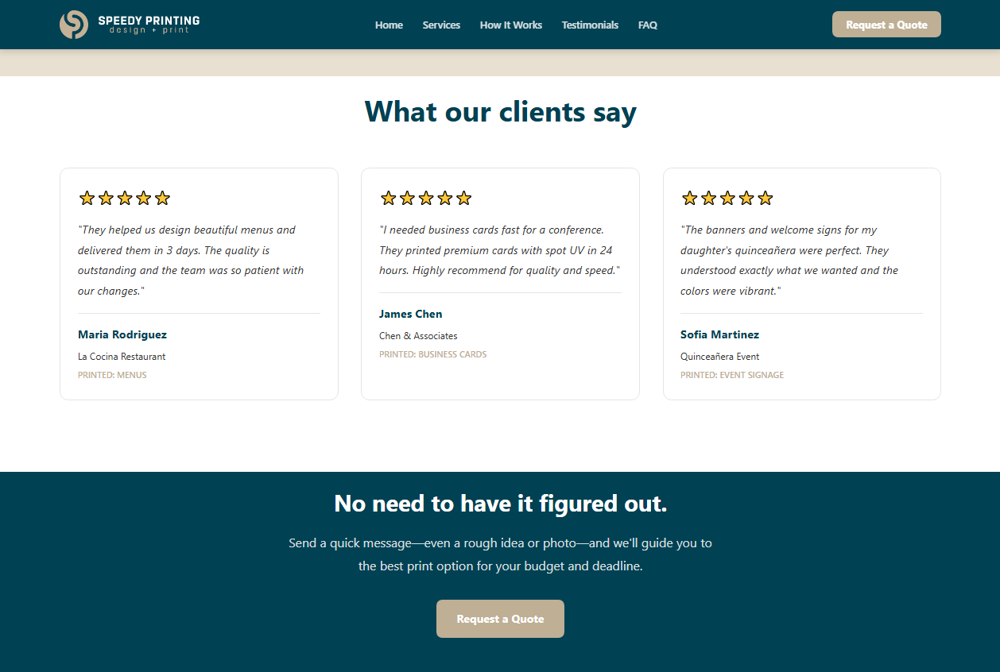
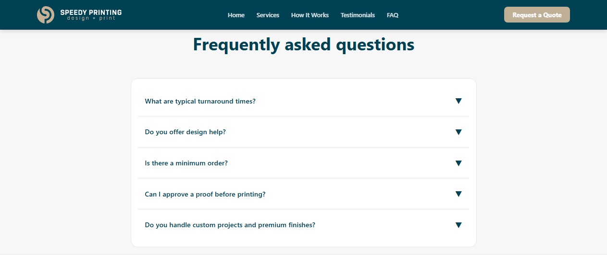
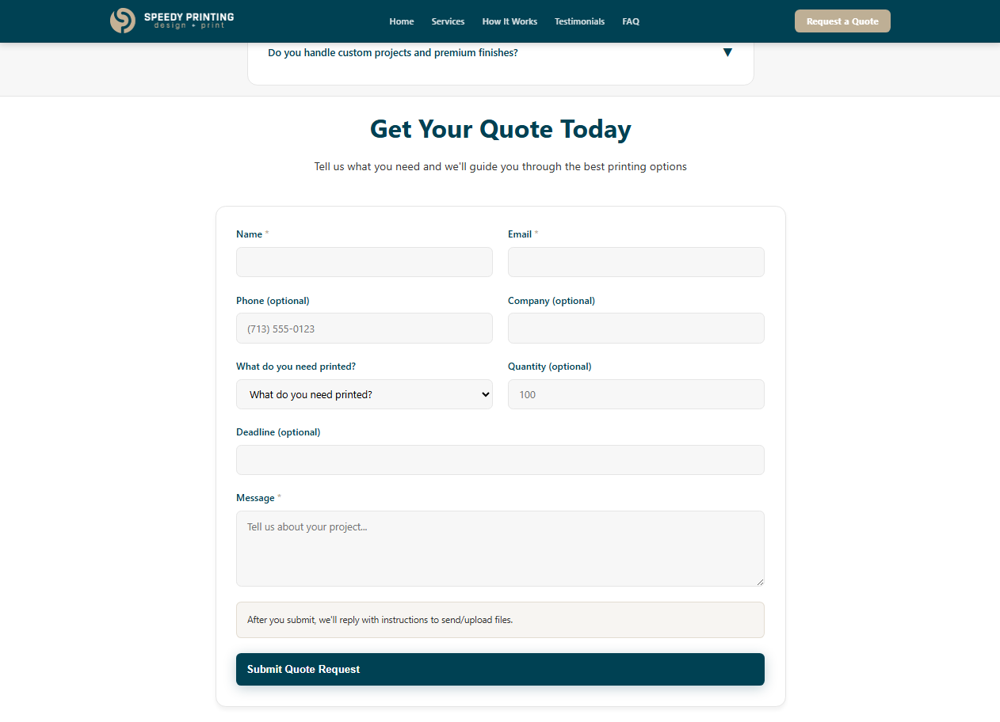
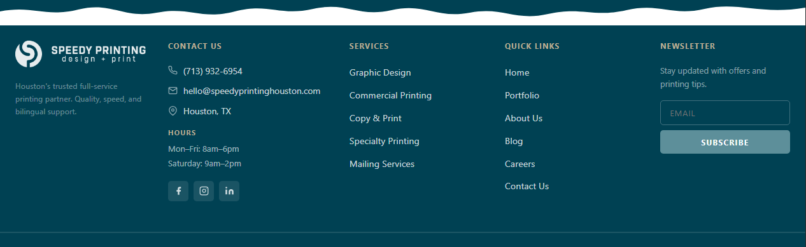

<div align="center">


<br/>


<br/>


<br/>

[](https://myspeedyprinting.com)
[](https://github.com/Agabo32/myspeedyprinting-landingpage)

</div>

---

## 📋 Descripción del Proyecto

**My Speedy Printing** es el sitio web corporativo de una empresa de impresión y soluciones gráficas ubicada en **Houston, TX**. El proyecto fue desarrollado como una landing page moderna, enfocada en conversión y experiencia de usuario, con soporte bilingüe (EN/ES).

El sitio fue construido inicialmente con **HTML, CSS, JavaScript y PHP**, y posteriormente **migrado e integrado como plantilla personalizada de WordPress** para permitir la administración dinámica del contenido por parte del cliente.

```
🏢 Cliente:    Speedy Printing — Houston, TX
🌐 Tipo:       Sitio web corporativo + plantilla WordPress
🎯 Objetivo:   Aumentar conversiones y presencia digital
📱 Alcance:    Landing page responsiva, bilingüe y optimizada
```

---

## ✨ Características del Sitio

<table>
<tr>
<td width="50%">

**🎨 Diseño & UX**
- Diseño responsive (mobile-first)
- Interfaz moderna con paleta teal/beige
- Tipografía clara y jerarquía visual cuidada
- Soporte bilingüe: **English / Español**
- Animaciones suaves y llamadas a la acción claras

</td>
<td width="50%">

**⚙️ Funcionalidades**
- Formulario de cotización con validación
- Sección de servicios con grilla de 9 categorías
- Sección de testimonios de clientes reales
- FAQ con acordeón interactivo
- Integración con WordPress como plantilla custom

</td>
</tr>
</table>

---

## 🗂️ Secciones del Sitio

<details open>
<summary><b>🏠 Hero — Página principal</b></summary>
<br/>

> *"Premium printing that makes your brand look sharp — fast, local, and reliable."*
> Landing con headline directo, badges de propuesta de valor y CTAs principales.



</details>

---

<details>
<summary><b>🖨️ Servicios — What we print</b></summary>
<br/>

> Grilla de 9 servicios de impresión: tarjetas de presentación, flyers, banners, stickers, invitaciones, vehicle wraps, mailing directo, acabados premium y soporte de diseño.



</details>

---

<details>
<summary><b>⚙️ Proceso — How it works</b></summary>
<br/>

> Proceso en 3 pasos: **01** Comparte tu necesidad → **02** Recomendamos & confirmamos → **03** Imprimimos y entregamos.



</details>

---

<details>
<summary><b>🏆 Diferenciadores — Why clients come back</b></summary>
<br/>

> Control de calidad consistente, entrega rápida, soporte en selección de materiales, accountability local y más.



</details>

---

<details>
<summary><b>⭐ Testimonios — What our clients say</b></summary>
<br/>

> Reseñas reales de clientes: restaurantes, empresas y eventos. Con nombre, empresa y tipo de impresión.



</details>

---

<details>
<summary><b>❓ FAQ — Frequently asked questions</b></summary>
<br/>

> Acordeón interactivo con respuestas a las preguntas más comunes sobre tiempos de entrega, pedidos mínimos, diseño y acabados custom.



</details>

---

<details>
<summary><b>📬 Formulario — Get Your Quote Today</b></summary>
<br/>

> Formulario completo con: nombre, email, teléfono, empresa, tipo de producto, cantidad, deadline y mensaje. Validación en tiempo real.



</details>

---

<details>
<summary><b>🔻 Footer</b></summary>
<br/>

> Footer con contacto (teléfono, email, dirección), horarios de atención, mapa de navegación, newsletter y redes sociales.



</details>

---

## 🛠️ Tecnologías Utilizadas

<div align="center">

| Capa | Tecnología | Uso |
|---|---|---|
| 🎨 Estructura |  | Maquetado semántico y accesible |
| 💅 Estilos |  | Diseño responsive, animaciones, variables CSS |
| ⚡ Interacción |  | FAQ acordeón, formulario, scroll behavior |
| 🔧 Backend |  | Procesamiento del formulario de contacto |
| 🌐 CMS |  | Plantilla personalizada para gestión de contenido |
| 🔁 Control |  | Control de versiones |

</div>

---

## 🗄️ Estructura del Proyecto

```
📦 myspeedyprinting-landingpage/
├── 🎨 assets/
│   ├── css/            # Hojas de estilo y variables
│   ├── js/             # Scripts e interactividad
│   └── img/            # Imágenes e íconos
├── 📄 docs/            # Capturas de pantalla
├── 🔧 template/        # Archivos de plantilla WordPress
│   ├── header.php
│   ├── footer.php
│   ├── functions.php
│   └── style.css
└── 🚀 index.php        # Punto de entrada principal
```

---

## ⚙️ Instalación

**Versión estática (HTML/CSS/JS):**

```bash
# 1. Clonar el repositorio
git clone https://github.com/Agabo32/myspeedyprinting-landingpage.git

# 2. Abrir index.php con XAMPP/Apache o Live Server
```

**Versión WordPress:**

```bash
# 1. Copiar la carpeta /template/ dentro de:
wp-content/themes/myspeedyprinting/

# 2. Activar el tema desde el panel de WordPress
# Apariencia → Temas → My Speedy Printing → Activar
```

---

## 🔍 Lo que aprendí con este proyecto

```
✅ Diseño orientado a conversión (CRO) para sitios corporativos
✅ Desarrollo de plantillas WordPress desde cero (sin constructores)
✅ Manejo de formularios PHP con validación del lado servidor
✅ Buenas prácticas de SEO semántico con HTML5
✅ Trabajo con cliente real: requerimientos, iteraciones y entrega final
✅ Diseño bilingüe y accesibilidad básica (EN/ES)
```

---

## 👨‍💻 Autor

<div align="center">


### Gabriel Torrealba

**Desarrollador Web Junior**
*Ingeniería de Sistemas*

[](https://github.com/Agabo32)
[](#)

</div>

---

<div align="center">


</div>
